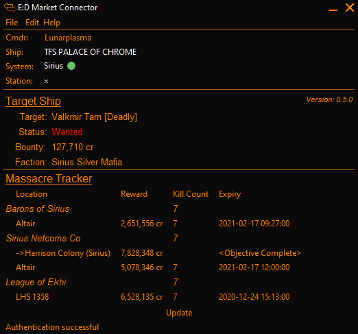

# EDMC-CombatTracker

This is a plugin for the [E:D Market Connector (EDMC)](https://github.com/EDCD/EDMarketConnector/wiki). 

The Target Ship panel displays information on the currently-targeted ship, including their bounty (normally reachable in the contacts side-panel).

The Massacre Tracker panel displays current Massacre missions. Its purpose is to make tracking of these missions easier. 
   
     
   
## Installation

Unzip the release zip into the EDMC plugins* directory. Restart EDMC to find the plugin.

\* You can find the plugins directory in EDMC Settings -> plugins tab. directory.  

## Massacre Tracker Notes

Massacre missions are grouped by faction, and their total required kill count is displayed alongside the faction name.

As missions are completed, the total kill count for that faction will be updated.

**NOTE:** The kill counts are **_not_** updated as you destroy enemy ships. They are only updated when you complete your objective.